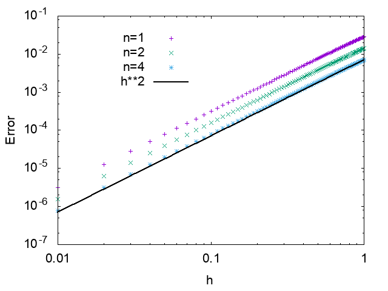
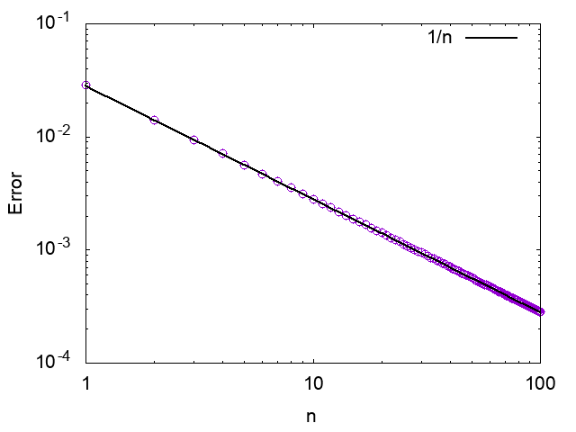
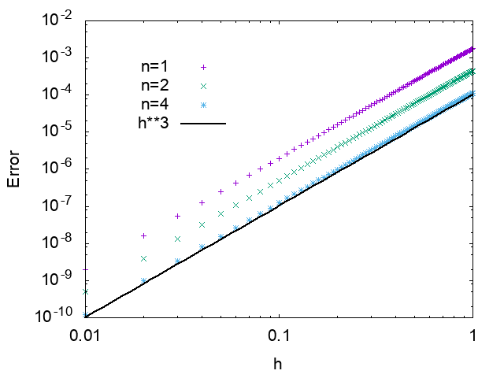
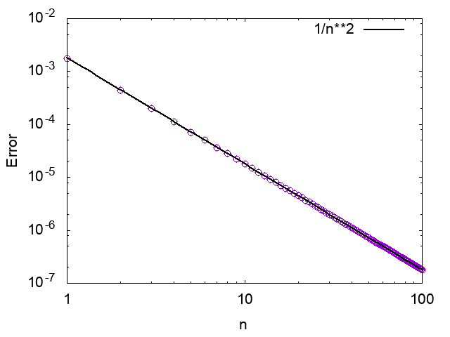

[Japanese](README_ja.md)/ English

# Sample Code of Lie–Trotter product formula

## Summary

This sample applies [Lie-Trotter product formula](https://en.wikipedia.org/wiki/Lie_product_formula) to 2 by 2 matrix, and sees orders of truncation errors.

Consider some operators X, Y, and Z, satisfying Z = X + Y.
Then the Lie-Trotter product formulae are

* the normal decomposition
    * Exp(h Z) = (Exp(h/n X) Exp(h/n Y))^n + O(h^2/n)
* the 2nd-Order Symmetric decomposition
    * Exp(h Z) = (Exp(h/2n X) Exp(h/n Y) Exp(h/2n X))^n + O(h^3/n^2)

where n is a decomposition number and h is a c-number (usually a time-step).

This sample calculates both hand-sides and checks the truncation errors.
The truncation errors are determined by Frobenius norm.

## Usage

```
$ make
```

## Results

### Normal Decomposition

h-dependence of the truncation error is O(h^2)


n-dependence of the truncation error is O(1/n)


### 2nd-Order Symmetric Decomposition

h-dependence of the truncation error is O(h^3)


n-dependence of the truncation error is O(1/n^2)

