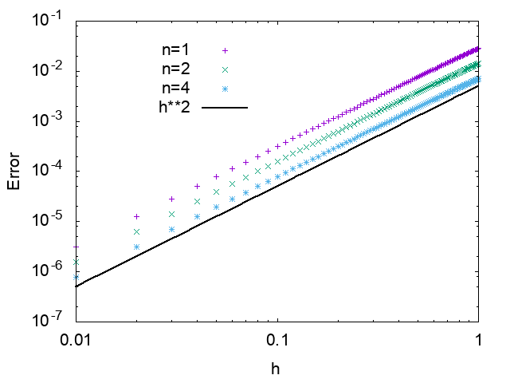

Japanese/ [English](README.md)
# トロッター分解のサンプル

## 概要

非可換な演算子X, Y, Zがあり、 Z=X+Yであるとする。この時、以下の公式が成り立つ。

exp(h Z) = (exp(h/n X) exp(h/n Y))^n + O(h^2/n),

ここでhはc-数(数値計算上では時間刻みに対応)、nが分解数である。
この公式は[リー・トロッター公式](https://ja.wikipedia.org/wiki/%E3%83%AA%E3%83%BC%E3%83%BB%E3%83%88%E3%83%AD%E3%83%83%E3%82%BF%E3%83%BC%E7%A9%8D%E5%85%AC%E5%BC%8F)などと呼ばれるが、業界や用途によってはトロッター分解、鈴木・トロッター分解などとも呼ばれ、
exp(h (X+Y))を厳密に評価することは難しいが、exp(tX)やexp(tY)は簡単に計算できる場合などに用いられる。
このサンプルは、X, Y, Zを行列とし、トロッター分解の近似のエラーが時間刻みhの自乗、及び分解数nに反比例することを確認する。
なお、誤差はフロベニウスノルムで評価している。

## 使い方

```
$ make
```
## 実行結果

誤差の時間刻みh依存性。h^2に比例していることがわかる。


誤差の分解数n依存性。1/nに比例していることがわかる。

